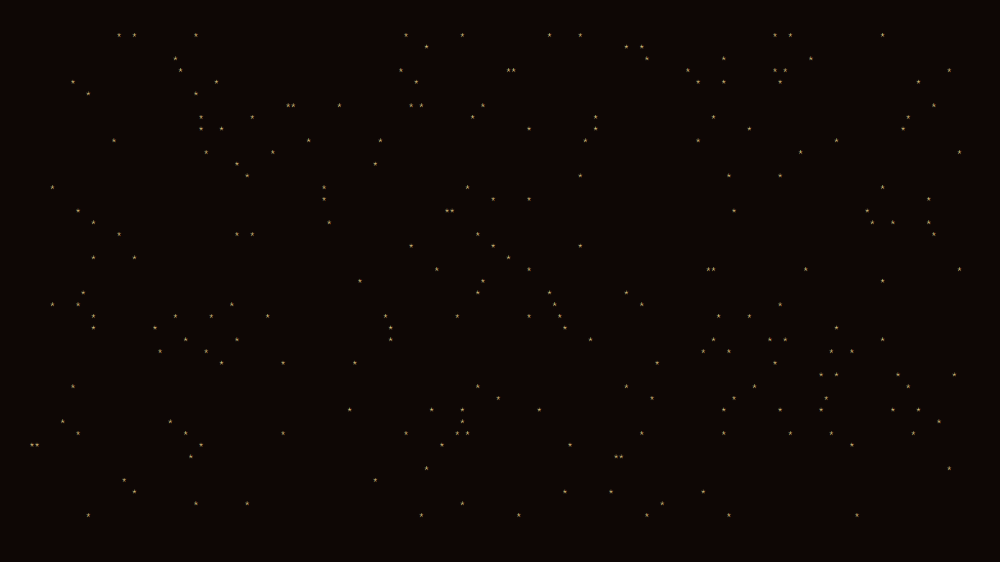

A shell scripts to print some stars to your terminal. Use with lolcat for maximum funkyness!



#### Options:
    -h              : Display this help text.
    -c ch           : Use [ch] instead of stars.
    -d time         : Set the time delay between stars. Defaults to 0.2 seconds.
    -n N            : Set the number of stars before clearing the screen.


### Installing

To install the script, first clone this repo using:

```bash
git clone https://github.com/rwithik/stars.sh
```

Then:
```bash
cd stars.sh
sudo make install
```

### Uninstalling

```bash
cd stars.sh
sudo make uninstall
```
### Running

```bash
stars
```